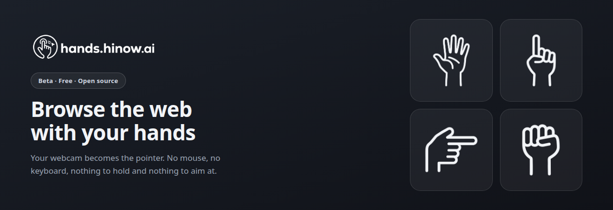
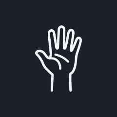
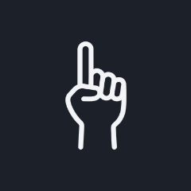
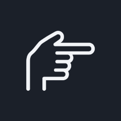
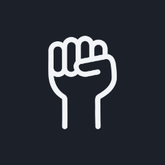
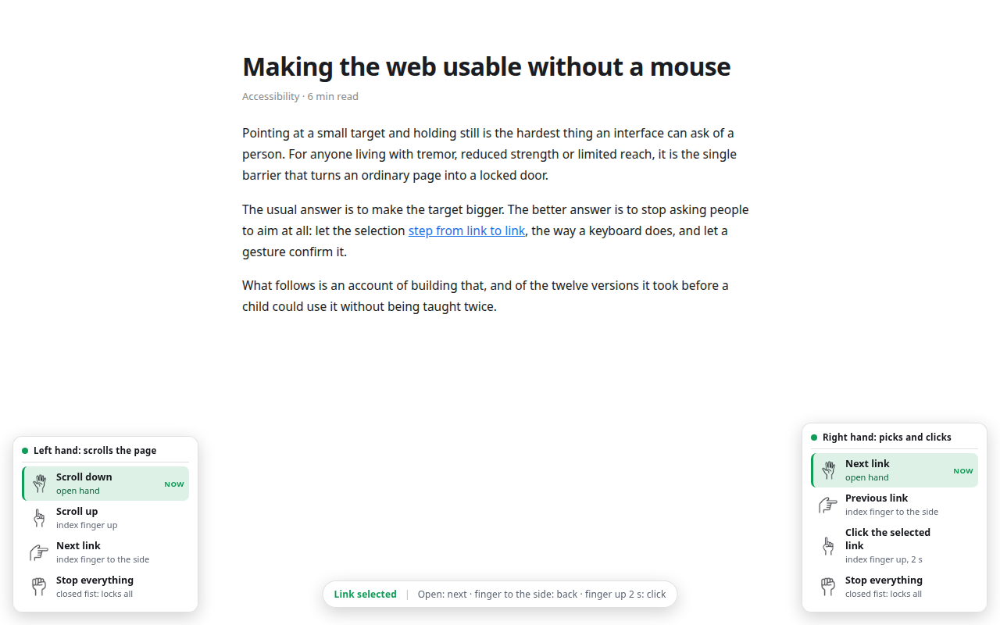

<div align="center">

<a href="https://hands.hinow.ai">
  
</a>

<p>
  <a href="README.md">English</a>
  &nbsp;&middot;&nbsp;
  <b>Português</b>
</p>

<p>
  <a href="https://hands.hinow.ai"><strong>hands.hinow.ai</strong></a>
  &nbsp;&middot;&nbsp;
  <a href="https://hands.hinow.ai/pt/beta/">Instalar a versão de teste</a>
  &nbsp;&middot;&nbsp;
  <a href="https://www.hinow.ai/privacy">Privacidade</a>
</p>

<p>
  
  
  
  
</p>

</div>

Controle a navegação de **qualquer site** com as mãos, pela webcam. Extensão Chrome (MV3) que
transforma a câmera em ponteiro, para navegar deixar de depender de levar um cursor até um
alvo pequeno e mantê-lo lá.

**Para quem é.** Primeiro para quem não consegue usar um mouse com conforto: mobilidade
reduzida das mãos, tremor, pouca força ou pouco alcance. E, por tabela, para qualquer um com
as mãos ocupadas ou longe da mesa: quem apresenta slides do outro lado do palco, quem dá aula
na lousa, quem está com as mãos na massa e a receita na tela.

**Privacidade.** O vídeo nunca sai da máquina. Câmera e modelo rodam localmente, e o que
trafega entre os processos são só os gestos já reconhecidos. Nada é gravado nem enviado.

---

## Os quatro gestos

Um papel por mão. É o vocabulário inteiro.

<table>
<tr>
<td align="center" width="25%"></td>
<td align="center" width="25%"></td>
<td align="center" width="25%"></td>
<td align="center" width="25%"></td>
</tr>
<tr>
<td align="center"><b>Mão aberta</b><br><sub>rola a página, ou vai para o próximo link</sub></td>
<td align="center"><b>Indicador para cima</b><br><sub>sobe a página, ou clica se você segurar dois segundos</sub></td>
<td align="center"><b>Indicador para o lado</b><br><sub>anda de um link para o outro</sub></td>
<td align="center"><b>Punho fechado</b><br><sub>trava tudo, em qualquer das mãos</sub></td>
</tr>
</table>

A mesma pose significa uma coisa na mão que rola e outra na que escolhe, então o mapa completo
é este:

| Mão | Gesto | Ação |
|---|---|---|
| Mão que rola | Mão aberta | Rola a página para baixo |
| Mão que rola | Indicador para cima | Rola a página para cima |
| Mão que rola | Indicador para o lado | Seleciona o próximo link |
| Mão que rola | Punho fechado | Para tudo |
| Mão que escolhe | Mão aberta | Seleciona o próximo link |
| Mão que escolhe | Indicador para o lado | Volta ao link anterior |
| Mão que escolhe | Indicador para cima, 2 s | Clica no link selecionado |
| Mão que escolhe | Punho fechado | Para tudo |
| As duas | Mão aberta + dedo para a direita | Próxima página |
| As duas | Mão aberta + dedo para a esquerda | Página anterior |

Qual mão faz o quê é escolha de quem usa, no popup, e há **modo canhoto**.

**O punho é o freio de emergência, nas duas mãos.** Um punho fechado em qualquer mão anula os
gestos da outra: nada rola, nada anda, nada clica, nada troca de página, e o HUD escreve
`Pausado`. A pose mais fácil de formar interrompe qualquer coisa em andamento, e a seleção fica
onde está: punho pausa, não apaga. `next_link` existe nas duas mãos de propósito, porque
avançar é a ação mais frequente, e dois caminhos motores para o mesmo comando são redundância a
favor de quem tem controle limitado de uma das mãos.

O rolar para cima exige a direção do dedo além da pose (apontar para baixo não sobe a tela) e
só começa depois de a pose se sustentar por um quarto de segundo: fechar a mão aberta passa por
um "apontar" transitório, já que o indicador é o último dedo a dobrar, e sem a espera parar de
rolar daria um soluço na direção contrária.

Tirar as mãos do quadro para tudo. A falha, quando houver, é para o lado de não executar nada.

**Qual mão é qual: a posição decide, não o rótulo do modelo.** O rastreador erra o rótulo
esquerda/direita com frequência, e com papéis fixos um rótulo trocado inverte os comandos.
Então o papel vem da geometria do corpo: de frente para a câmera, a mão esquerda aparece do
lado esquerdo da imagem espelhada, como num espelho. Com duas mãos no quadro a posição decide
sozinha; uma mão que fica sozinha mantém o papel que tinha, que é o que deixa a mão que escolhe
cruzar o centro para alcançar um link do outro lado sem "virar" a outra; só uma mão nova, sem
histórico, usa o rótulo do modelo. O mesmo passo elimina a mão fantasma: a mesma mão detectada
em dobro pelo MediaPipe.

**Por que estas poses.** Mão aberta e punho são as duas mais separáveis que o rastreador
produz. A aberta exige só 4 dos 5 dedos lidos como esticados, o que tolera um dedo mal
rastreado; o punho exige zero; e entre as duas há uma zona morta larga onde um frame ruim não
vira comando nenhum. No apontar, só o estado do indicador importa: médio e anelar contam a
favor mesmo dobrados pela metade. O anelar compartilha tendão com o médio e raramente dobra por
completo, e era exatamente essa exigência que fazia a pose natural de apontar não ser
reconhecida.

**A mão que escolhe não mira.** Levar um cursor até um alvo e mantê-lo lá é a tarefa motora
mais difícil que uma interface pode pedir: tremor, deriva e câmera ruim conspiram contra ela.
Este vocabulário a elimina. A seleção anda **de link em link, na ordem de leitura**. Abrir a
mão avança; deitar o indicador para o lado volta (qualquer lado, porque a intenção é "voltar",
não uma direção geométrica); manter a pose vai passando, cerca de 0,6 s por link. O punho
**para**, nas duas mãos: a pose de descanso é uma só em todo o vocabulário. O retângulo azul e
a bolinha do cursor mostram o que está selecionado, e links cobertos por banners são pulados
automaticamente. Nas pontas da tela a seleção fica onde está: é a rolagem da outra mão que
revela mais links.

**O clique é sustentar o indicador para cima por 2 segundos**, com o arco de progresso enchendo
ao redor do link selecionado. Cima clica e lado volta, e entre os dois há uma banda morta larga
na diagonal: um dedo a meio caminho não faz nem um nem outro, de propósito. O voltar ainda
exige um quarto de segundo de sustentação, porque levantar o dedo até a vertical passa pelo
"lado", e esse trajeto não pode voltar um link sem querer. Mantendo o dedo para cima, um novo
clique a cada 2 segundos: se a pessoa continua ali, é porque a página não respondeu, e insistir
é o que ela faria com um mouse. Um vacilo curto na leitura da pose não zera a contagem; abrir a
mão ou fechar o punho, que são intenção clara, zeram na hora.

**Baixar a mão não perde a seleção.** Quem se cansa descansa o braço, e o link continua
selecionado esperando o clique. Para o público deste projeto, crianças e pessoas com mobilidade
reduzida, sustentar o braço no ar é o custo real de usar a interface, e o vocabulário inteiro
foi desenhado para minimizá-lo.

**Trocar de página exige as duas mãos, de propósito.** A mão que escolhe, deitada para o lado,
diz a direção (esquerda para a página anterior, direita para a próxima, as setas do navegador)
e a mão aberta confirma, sustentando por cerca de um segundo com um arco âmbar no centro da
tela. É a única ação do vocabulário que substitui a tela inteira, então é a única que pede duas
poses simultâneas: uma combinação dessas não se forma por acidente. É uma página por gesto:
para voltar duas, solte e refaça. E, enquanto a combinação está de pé, a rolagem e o
voltar-link ficam suspensos, porque ela tem precedência.

> Arraste, zoom, clique por pinça, histórico, a rolagem por dois dedos e a mira livre por
> cursor estão **desativados**. O motor que os reconhece continua no repositório, testado, para
> serem reintroduzidos um a um. O que não está no vocabulário acima não age na página.

---

## O que aparece na tela

<div align="center">
  
</div>

Três camadas, todas desligáveis no popup para quem já não precisa delas.

**Guia de gestos, um painel por mão.** Canto inferior esquerdo para a mão que rola, direito
para a que clica. Cada linha traz o que o gesto faz e a pose que o forma, a informação que
falta quando alguém sabe que existe um gesto de rolar mas não lembra como fazê-lo. A linha do
comando em curso acende. Mão fora do quadro esmaece o painel inteiro: é a resposta à pergunta
"ele está me vendo?" sem precisar testar um gesto para descobrir.

O destaque nunca é só a cor. A linha ativa muda de fundo, ganha uma barra à esquerda e escreve
`agora`, então quem não distingue o verde continua sabendo qual está ativa. O `Parar` acende em
vermelho, não em verde, porque parar é o oposto de agir e a cor precisa dizer isso sozinha.

**Pontas dos dedos.** Cinco bolinhas por mão, uma cor por dedo, mão esquerda em tons quentes e
direita em tons frios, porque a primeira pergunta de quem olha a tela é qual das duas é a sua
mão direita. O indicador leva um anel branco por ser o que comanda o cursor. Quando o
rastreamento perde um dedo, isso fica visível no mesmo instante, e a pessoa tem o que corrigir:
a posição da mão, a luz ou o enquadramento.

As pontas passam pela mesma conversão do cursor, e não pelo quadro inteiro da câmera. É o que
faz a bolinha do indicador cair sobre o cursor que ela comanda, em vez de andar num espaço
próprio e desmentir a relação entre a mão e o ponteiro.

**Painel de estado.** No rodapé, diz em palavras o que está acontecendo agora: `Procurando as
mãos`, `Link selecionado`, `Rolando para baixo`, `Clicando`. O guia ensina o vocabulário; este
diz em que ponto dele você está.

Só as cinco pontas atravessam o IPC: dez números por mão, não os cento e trinta que os 21
landmarks custariam. É o suficiente para desenhar o rastreamento sem o peso que motivou deixar
o esqueleto inteiro fora do protocolo.

---

## Instalação

A extensão publicada ficará na Chrome Web Store. Até lá, existe uma
[versão de teste com o passo a passo](https://hands.hinow.ai/pt/beta/).

A partir do código:

```bash
npm install
npm run fetch:model     # baixa hand_landmarker.task (~7,5 MB), uma vez só
npm run build
```

Depois, em `chrome://extensions`: ative o **modo desenvolvedor**, clique em **Carregar sem
compactação** e escolha a pasta `dist/`.

Ative pelo ícone da extensão ou por <kbd>Alt</kbd>+<kbd>Shift</kbd>+<kbd>G</kbd>. Na primeira
ativação abre-se uma aba pedindo acesso à câmera: conceda ali, **uma vez para a extensão**, e
vale para todos os sites, e não por site visitado.

O pedido precisa dessa aba porque a câmera é aberta no documento offscreen, e um contexto sem
interface não pode exibir a caixa de permissão do Chrome: pedir de lá volta negado sem
perguntar nada. Como a permissão é gravada por origem, concedê-la numa página visível da
extensão libera o offscreen de vez. Se o acesso tiver sido bloqueado antes, remova o bloqueio
em `chrome://settings/content/camera` e ative de novo.

---

## Como funciona

Três processos, cada um com uma responsabilidade.

```
  ┌───────────────────────┐   gestos    ┌──────────────────┐   gestos   ┌───────────────────┐
  │  documento offscreen  │ ──────────► │  service worker  │ ─────────► │  content script   │
  │  câmera + modelo +    │             │  roteia p/ a     │            │  cursor, HUD,     │
  │  reconhecimento       │             │  aba ativa       │            │  ações na página  │
  └───────────────────────┘             └──────────────────┘            └─────────┬─────────┘
                                                                                  │ postMessage
                                                                        ┌─────────▼─────────┐
                                                                        │  content script   │
                                                                        │  dentro do iframe │
                                                                        └───────────────────┘
```

**Por que um documento offscreen.** A origem dele é a própria extensão, então a permissão de
câmera vale para todos os sites de uma vez. E existe uma única instância da câmera e do modelo
para o navegador inteiro, porque uma por aba seria inviável, já que a webcam é exclusiva.

**Como o site é operado.** Eventos sintéticos disparam os handlers de JavaScript de uma página,
mas não os comportamentos nativos do navegador: um `wheel` sintético não rola nada por conta
própria. Já um mapa escuta `wheel` em JS e faz o próprio zoom.

A saída é uma estratégia de duas camadas. Despachamos o evento real primeiro; se o site chamar
`preventDefault()`, ele assumiu o controle e paramos por aí. Se ninguém cancelar, aplicamos nós
mesmos o efeito nativo equivalente. O mesmo gesto rola uma página de notícias e dá zoom no
Google Maps, sem que o código precise saber em qual dos dois está.

**Abas que já estavam abertas.** Content scripts declarados no manifest só entram em páginas
carregadas depois da instalação. Para que "qualquer site" seja verdade desde o primeiro
instante, o service worker injeta o script retroativamente nas abas existentes ao instalar, e
sonda a aba com um ping antes de ativá-la, injetando se não houver resposta. Uma marca no lado
do content script impede que a dupla entrada crie dois cursores.

**Iframes de outra origem.** O content script é injetado em todos os frames, então cada iframe
tem a própria cópia rodando lá dentro, com acesso pleno ao seu DOM. O frame de cima detecta que
o cursor está sobre um `<iframe>`, converte a coordenada para o sistema local daquele frame e
manda o comando por `postMessage`, a única ponte que atravessa origens. É por isso que funciona
no Maps sem chave de API e sem nenhuma cooperação do site.

---

## O que dá a fluidez

Não é acessório: é a maior parte da engenharia.

**One Euro Filter.** O rastreamento tem ruído de alguns pixels por frame mesmo com a mão
parada. Um filtro fixo remove o tremor mas adiciona lag, e lag mata a sensação de controle
direto. O One Euro adapta a frequência de corte à velocidade: mão parada filtra forte e o
cursor fica cravado, que é o que permite acertar um link pequeno; movimento amplo quase não
filtra e o cursor acompanha.

**Interpolação a 60 fps.** O modelo entrega cerca de 30 amostras por segundo. O cursor é
interpolado a cada frame de animação, senão o movimento fica visivelmente escalonado.

**Área ativa reduzida.** Só a região central do quadro mapeia para a tela inteira, então os
cantos ficam alcançáveis sem esticar o braço até a borda do campo de visão, onde o rastreamento
degrada.

**Histerese e confirmação curta.** Cada gesto liga num limiar e desliga em outro, com uma banda
morta entre eles. Sem isso, um valor oscilando em torno do limiar gera dezenas de cliques por
segundo. A confirmação exige 3 frames consecutivos, cerca de 100 ms, rápido o bastante para
parecer instantâneo.

**Inércia na rolagem.** Um movimento rápido percorre bastante página, como no scroll por toque.

---

## O que dá a precisão

> Esta seção descreve a mira fina para alvos pequenos. Com a seleção sequencial, a mira livre
> por cursor saiu do caminho ativo, e com ela o magnetismo, o ganho adaptativo e o clique
> armado, que ficam aqui porque voltam junto com o arraste. A estabilização da ponta continua
> valendo para a direção do apontar da mão que rola.

Filtrar remove o tremor, não a amplificação. A área ativa amplia o quadro da câmera em cerca de
cinco vezes até a tela, então cada pixel de erro do rastreamento vira cinco na tela, e nenhum
filtro desfaz isso. Quatro mecanismos atacam a amplificação em si.

**Ganho adaptativo.** Movimento lento move o cursor a cerca de um terço da distância da mão,
que é de onde vem a mira fina; movimento rápido volta ao mapeamento absoluto. A correspondência
com a posição absoluta é restaurada durante os movimentos amplos, quando a atenção não está na
mira.

**Ponta do dedo estabilizada.** A ponta é o landmark mais ruidoso que o modelo produz, porque
fica no fim da cadeia cinemática e acumula o erro de todas as juntas. Como um dedo esticado é
aproximadamente reto, projetamos a ponta sobre o eixo definido por duas juntas internas, mais
estáveis. O ruído perpendicular, que é quase todo o tremor lateral, desaparece.

**Clique armado antes de fechar.** Unir os dedos desloca a mão inteira, então mirar e clicar na
mesma coordenada seria impossível. A posição é congelada quando a pinça *começa* a fechar, e é
ela que o clique usa.

**Magnetismo.** Dentro de cerca de 26 px, o cursor é levado para dentro do alvo clicável.
Aplicado apenas à posição visível: o alvo interno do ponteiro continua livre, então sair é tão
fácil quanto entrar. Desliga sobre canvas, mapas e durante arrastes, onde a posição livre é o
conteúdo.

Medido em `npm run measure`, para tela 1920×1080 e tremor de mão de cerca de 2 px no quadro:

| | antes | depois |
|---|---|---|
| Oscilação do cursor parado | 14,8 px | **2,4 px** |
| Menor alvo confortável | ~30 px | **~5 px** |
| Ruído da ponta do dedo | 46,9 px | **11,7 px** (−75%) |

E em navegador real, sobre alvos a até 26 px do cursor: **0% de acerto sem magnetismo, 100%
com**.

Os números do medidor usam um modelo de ruído; o rastreamento real traz outros erros, então
espere um resultado melhor que antes, não exatamente estes valores.

---

## Detecção invariante

O detector mede **ângulos de articulação**, invariantes a rotação e escala, e normaliza toda
distância pelo tamanho da própria palma, o que a torna independente da distância à câmera.

A abordagem ingênua ("a ponta do dedo tem Y menor que a junta, logo está esticado") só funciona
com a mão vertical e de frente. Comparação medida sobre as mesmas entradas sintéticas:

| | detector ingênuo | este |
|---|---|---|
| Sob rotação da mão | 45% correto | **100%** |
| Sob variação de escala | 64% correto | **100%** |

O caso mais grave da abordagem ingênua: com a mão a 180°, um punho é lido como mão aberta. São
gestos de ações opostas.

```bash
npm test              # asserções sobre o motor
npm run test:legacy   # a comparação acima, reproduzível
npm run measure       # relatório de precisão em pixels
```

---

## Campo de teste

```bash
npm run demo      # http://localhost:5599
```

Exercita alvos de clique de tamanhos decrescentes, rolagem em container aninhado, arraste, zoom
em imagem e um canvas que cancela os próprios eventos, como um mapa.

Para testar iframe de outra origem, suba uma segunda instância e abra `/iframe-test.html`:

```bash
PORT=5600 npm run demo
```

---

## Ajustes

No popup da extensão:

- **Aparência do painel**: claro ou escuro.
- **Instruções na tela**: os dois painéis de gestos nos cantos, com aparência clara ou escura
  independente da do painel, porque a página que se lê pode ser escura e o painel de
  configuração claro.
- **Painel de estado** e **pontas dos dedos** (diagnóstico): o que mais aparece sobre a página.
- **Área de alcance**: quanto do quadro mapeia para a tela. Menor exige menos movimento de
  braço.
- **Estabilidade do cursor**: corte mínimo do filtro. Menor deixa mais firme, com um pouco mais
  de lag.
- **Velocidade da rolagem**: quanto o movimento da mão é ampliado.

---

## A arte

Os desenhos de mão e o logo vivem em `art/`, fora do pacote, como line-art preto sobre fundo
branco. `npm run art` os converte em **máscaras**, onde o desenho vira o canal alfa e a cor sai
da imagem, que o CSS pinta com `currentColor`. É o que faz o mesmo arquivo servir aos dois
temas sem uma segunda arte invertida, e o que derruba 3,6 MB de PNG para 56 kB dentro da
extensão. Trocar um desenho é substituir o arquivo em `art/` e rodar o script de novo.

`npm run art:readme` regera as imagens de `.github/` a partir dessa mesma arte e do CSS do
próprio overlay, para as figuras deste arquivo não descolarem do produto.

---

## Limitações conhecidas

- Páginas internas do Chrome (`chrome://`, a Web Store) não aceitam content scripts. Nada
  funciona nelas, e nem pode.
- PDFs no visualizador nativo e vídeo protegido por DRM não expõem o conteúdo ao DOM: o cursor
  aparece, mas não há elemento para clicar.
- Digitar texto não está implementado: o teclado continua necessário para campos de entrada.
- Só a aba ativa recebe gestos, por decisão de projeto: uma câmera, uma aba.
- O reconhecimento cai de qualidade com iluminação muito fraca ou contraluz forte.

---

## Estrutura

```
src/core/        motor independente de navegador
  filters.ts       One Euro, histerese, estabilização
  handModel.ts     geometria da mão, invariância
  gestures.ts      vocabulário e reconhecimento
  pointer.ts       mapeamento mão→tela, clutch, inércia
  handedness.ts    qual mão é qual, pela posição no corpo
  spatial.ts       escolha de alvo por direção
  wire.ts          formato trocado entre processos
src/content/     o que age dentro da página
  synth.ts         síntese de eventos, duas camadas
  controller.ts    máquina de estados
  overlay.ts       cursor e realce (Shadow DOM)
  targets.ts       coleta de links da página
  imageZoom.ts     visualizador de imagem
  frames.ts        ponte para iframes
  frameAgent.ts    executor dentro de um iframe
src/offscreen/   câmera, modelo, reconhecimento
src/background/  ciclo de vida e roteamento
src/popup/       painel de controle
art/             arte de origem (fora do pacote) → npm run art
public/_locales/ traduções; o idioma segue o navegador
store/           material da ficha da Chrome Web Store
```

---

## Licença

Faça o que quiser com este código (use, altere, redistribua, venda), com **uma condição**:
mantenha um link visível para [hands.hinow.ai](https://hands.hinow.ai) em qualquer cópia ou
derivado. "Visível" quer dizer alcançável por quem usa o software sem abrir o código: uma tela
"sobre", um rodapé, a página da loja. Os termos completos estão em [LICENSE](LICENSE).

O projeto é gratuito e de código aberto porque acessibilidade não deveria ter pedágio.
